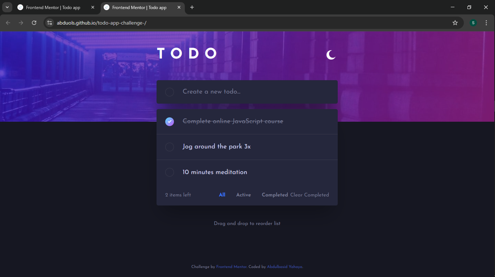
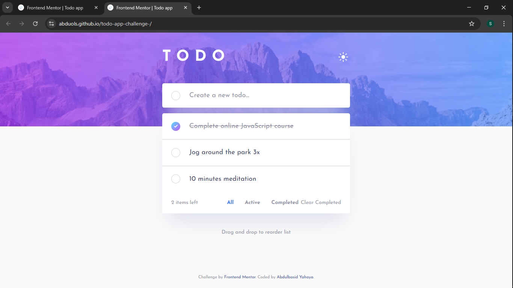

<!-- @format -->

# Frontend Mentor - Todo app solution

This is a solution to the [Todo app challenge on Frontend Mentor](https://www.frontendmentor.io/challenges/todo-app-Su1_KokOW).

## Table of contents

- [Overview](#overview)
  - [The challenge](#the-challenge)
  - [Screenshot](#screenshot)
  - [Links](#links)
- [My process](#my-process)
  - [Built with](#built-with)
  - [What I learned](#what-i-learned)
  - [Continued development](#continued-development)
- [Author](#author)

## Overview

### The challenge

Users should be able to:

- View the optimal layout for the app depending on their device's screen size
- See hover states for all interactive elements on the page
- Add new todos to the list
- Mark todos as complete
- Delete todos from the list
- Filter by all/active/complete todos
- Clear all completed todos
- Toggle light and dark mode
- **Bonus**: Drag and drop to reorder items on the list

### Screenshot

### Links

- Solution URL: [https://github.com/Abduols/todo-app-challenge-](https://github.com/Abduols/todo-app-challenge-)
- Live Site URL: [Add your live site URL here](https://abduols.github.io/todo-app-challenge-/)

## My process

### Built with

- Semantic HTML5 markup
- CSS custom properties
- Flexbox
- Mobile-first workflow
- Vanilla JavaScript
- Local Storage for data persistence

### What I learned

Through this project, I understood:

- CSS custom properties (CSS variables) for theme switching
- Responsive design with mobile-first approach
- Drag and drop API implementation
- Local Storage for persisting user data
- Event delegation and DOM manipulation
- CSS transitions and animations

### Continued development

I want to continue improving my skills in:

- More advanced JavaScript
- CSS flexbox and grid for complex layouts
- Accessibility best practices

## Author

- Frontend Mentor - [@Abduols](https://www.frontendmentor.io/profile/Abduols)
- GitHub - [Abdulbasid Yahaya](https://github.com/Abduols)
